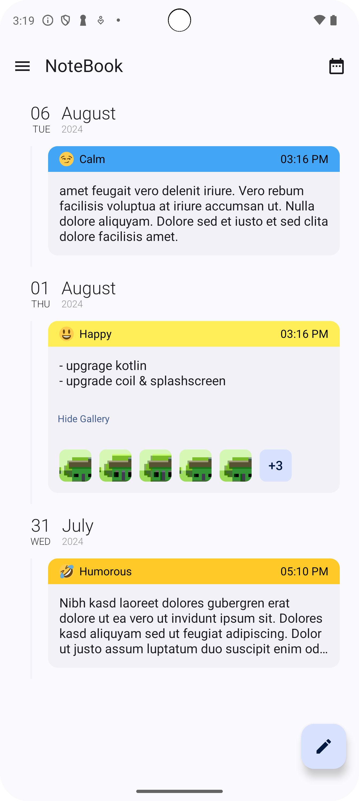
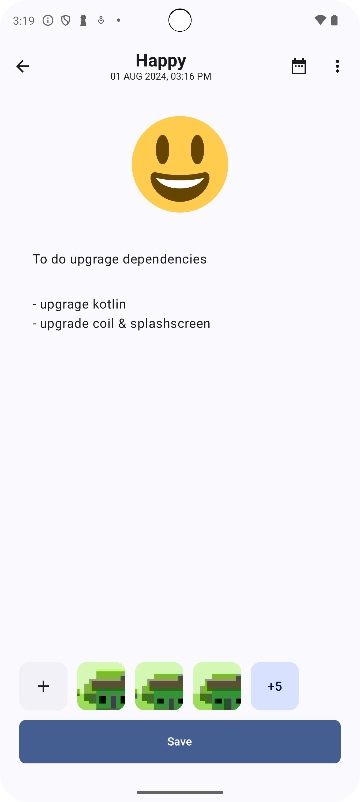

# Notebook Android Project

## Kotlin

### Architecture Component

### Multi-Modular Architecture

### Jetpack Compose UI

### Room Database

### Splash Api

### Material 3

### Coroutines

### Dagger-Hilt

### One-Tap Sign in with Google

### Firebase Authentication

### Firebase Storage

### Mongo DB Auth

### Mongo Realm/Device Sync

### Realm Kotlin SDK

### Mongo Atlas

### Google Authentication

### Synchronize the data between a client and the server

### Flexible Sync

### Date Time picker, clock and Calendar  <https://github.com/maxkeppeler/sheets-compose-dialogs>

